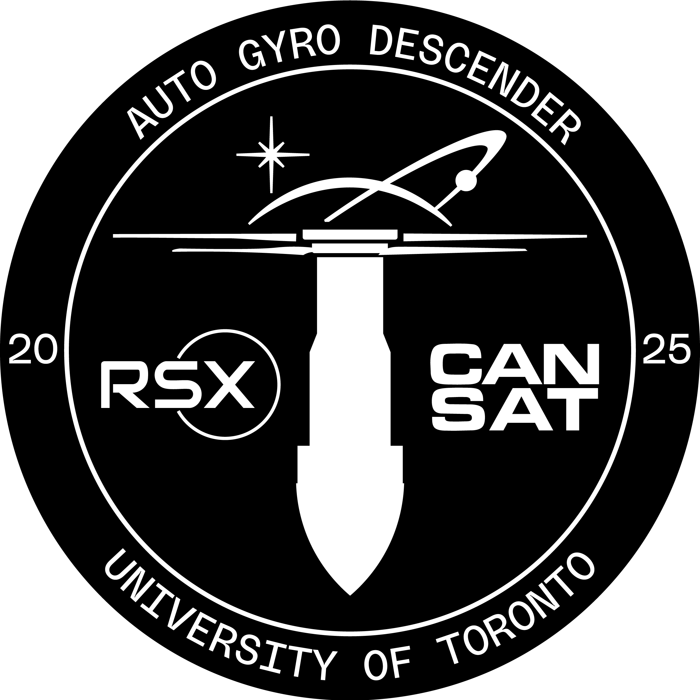

# RSX CanSat 2T4-2T5 Designs 

  
  
  

 

This repository is designed to manage the files made by the CanSat Team under the Robotics for Space eXploration (RSX) design team at the University of Toronto. 

**Competition Team Members:**
- Adam Kabbara | CanSat Team Lead
- Arthur Goetzke-Coburn | Mechanical Team Lead
- Daniel Yu | Electrical Team Lead
- Luke Watson | Software Team Lead
- Gianluca Ceccacci | Mechanical Team Member
- Nour Barsoum | Electrical Team Member
- Angelique Liao | Software Team Member
- Alexey Albert | Mechanical Team Member
- Robert Saab | Electrical Team Member

**CanSat Competition:**
- 📅 June 5-8, 2025
- 📍 Monterey, Virginia, United States

**Competition Deliverables:**
- 🏆 95.87725%: [CanSat 2025 Winners](https://cansatcompetition.com/winners.html)
- 📋 Scoresheet: [TBA]()
- 💾 Mission Data: [Team #3114 Mission Data](competition_documentation/3114_mission_data_cansat_2025.csv.xlsx)
- 📝 Preliminary Design Review: [Team #3114 PDR](competition_documentation/deliverables/Cansat2025_3114_PDR.pdf)
- 🛠️ Critical Design Review: [Team #3114 CDR](competition_documentation/deliverables/Cansat2025_3114_CDR.pdf)
- 🌡️ Environemental Testing Document: [Team #3114 ENV](competition_documentation/deliverables/Cansat2025_3114_Mission_Operations_Manual.pdf)
- 🗂️ Mission Operations Manual: [Team #3114 MOM](competition_documentation/deliverables/Cansat2025_3114_Mission_Operations_Manual.pdf)
- 🛰️ Post Flight Review: [Team #3114 PFR](competition_documentation/deliverables/Cansat2025_3114_PFR.pdf)

**Competition Results:**
- 🗺️ 5th Place Internationally!
- 🌎 1st in North America!
- 🍁 1st in Canada!

## Ground Station Usage
1. Download and run .msi file from Releases. Cannot be used on Apple MacOS.
2. This will create a folder with an exe file, note it depends on other files generated in the folder.
3. Once app is open click on CONNECTION button, choose a port and press open ground port.

## Folder Organization

**Calculations:**
  Python functions and calculations for sizing inductors and capacitors in a power electronics circuit, including formulas for inductor DC current, ripple current, peak current, and minimum capacitor value, with example calculations and printouts.

**Circuit Design:**
 This folder contains all the KiCad printed circuit board (PCB) designs our team has created. It also includes each PCB's related schematic, layout, and gerber files with associated custom KiCad symbols, footprints, and 3D models.

**Competition Documention:**
 All deliverables, team logos, and full results from the 2025 CanSat Competition in Monterey, Virginia, USA!

**Full Sensor Setup:**
 Initial code used to connect all payload sensor electronics together for testing before integration with full software telemetry.

**Ground Station Source:**
 The code and resources for the CanSat ground station application, including data files, a Python GUI for real-time telemetry visualization, setup scripts, and supporting assets for ground station operations are contained in this folder.

**PID:**
 The code, notebooks, and scripts for developing, testing, and simulating PID control algorithms and sensor integration for the CanSat project.

**PFR Plots:**
 Contains Python scripts and output images for generating 2D and 3D plots of CanSat mission and sensor data, including GPS, altitude, and other telemetry visualizations for post-flight review and analysis.

**Sensor Testing:**
 All sensors used on our CanSat are tested separately using an ESP32-WROOM-32D Dev Module microcontroller. This folder contains all related information regarding the tests completed on these sensors including past designs, schematics, pin connections, and code.

**Telemetry Source:**
 The source code and configuration files for the CanSat telemetry system, including firmware, libraries, and project workspace for real-time data transmission and logging.
